# Kelly Criterion Betting Simulator

A two-part research project on decision-making under uncertainty in
markets: **how much to bet** when you have an edge (Kelly sizing, and
what estimation error does to it), and **how to quote prices** when
some of your counterparties know more than you (market making, adverse
selection, and a reinforcement-learning agent that learns to cope).

Built in Python with numpy; every module unit-tested (40 tests);
every experiment reproducible from a script with fixed seeds.

## Section 1 -- Bet sizing and market making

### Day 1: Kelly with a known edge

Even-money bet, true win probability p = 0.55 (Kelly optimal f* = 0.10),
1,000 sequential bets, 20,000 Monte Carlo paths:

| Strategy | Median final bankroll | Mean final bankroll | P(losing >50%) |
|---|---:|---:|---:|
| Fixed 2% | 6.05 | 7.41 | 0.000 |
| Half Kelly (f = 0.05) | 42.6 | 142 | 0.003 |
| Full Kelly (f = 0.10) | 150 | 15,006 | 0.037 |
| Double Kelly (f = 0.20) | **0.87** | 23.9M | **0.457** |

- **Full Kelly maximises median (typical) growth**, consistent with theory.
- **Over-betting is catastrophic in the typical case**: double Kelly has a
  median *below the starting bankroll* and a ~46% chance of losing half the
  bankroll -- despite an enormous *mean*, driven entirely by a tiny number of
  extreme lucky paths. Mean outcomes are deeply misleading for multiplicative
  wealth processes.
- **Half Kelly gives up surprisingly little growth for a large cut in risk**,
  which is why practitioners rarely bet full Kelly.

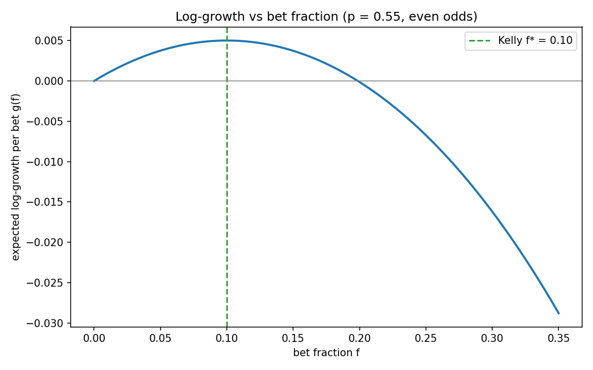
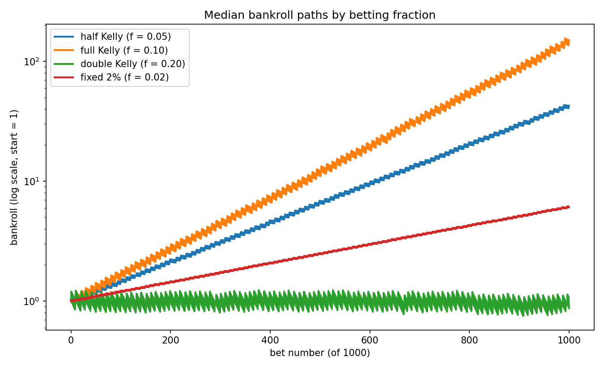

### Day 2: Kelly with an estimated edge

Real bettors never know p; they estimate it. Here the bettor observes a
finite history of outcomes, estimates the win rate, and bets
m x Kelly(estimate) against the true probability.

**Noise study.** The growth-maximising Kelly multiplier m falls as the
estimate gets noisier:

| Estimate quality | Best multiplier | Growth at best |
|---|---:|---:|
| Known edge (theory) | 1.00 | 0.00501 |
| Estimated from 1,000 bets | 0.90 | 0.00459 |
| Estimated from 200 bets | 0.65 | 0.00360 |
| Estimated from 50 bets | 0.45 | 0.00263 |

**Bias study.** A bettor who *believes* p = 0.55 when the truth is 0.52
(3 points of overconfidence) realises **negative** growth betting full
Kelly on the believed edge (-0.0035 per bet), while a multiplier around
0.3 remains profitable.

Why: the log-growth curve is asymmetric around its peak -- over-betting is
punished far more than under-betting -- so estimation error pushes optimal
sizing below full Kelly. This is the quantitative case for fractional
Kelly, and for conservatism whenever your edge is self-estimated.

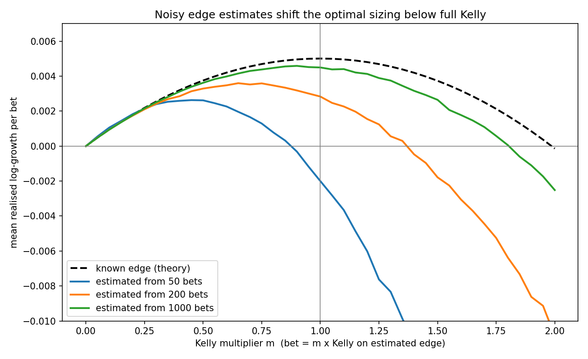
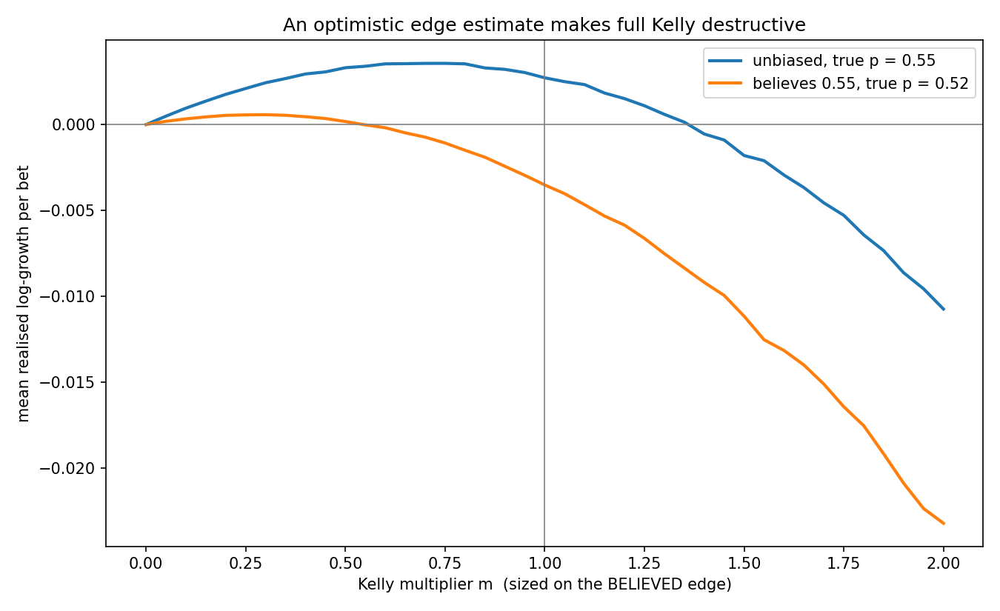

### Day 3: Market making against informed flow

A market-making game: a hidden value V (sum of three dice, mean 10.5)
and a maker quoting bid/ask each round. Noise traders (buy/sell at
random) pay the spread; informed traders (see V plus noise) only trade
when the maker's quotes are wrong. Positions settle at the true V.

A naive maker quoting a fixed +-1.0 spread around the prior, across
2,000 games of 100 rounds:

| Informed share | Mean P&L | Median P&L | P(loss) |
|---:|---:|---:|---:|
| 0% | 98.4 | 100.0 | 0.005 |
| 15% | 63.6 | 77.2 | 0.070 |
| 30% | 27.7 | 45.5 | 0.255 |
| 45% | **-9.0** | 19.0 | 0.445 |
| 60% | **-48.4** | -24.0 | 0.533 |

This is **adverse selection**: spread income from noise traders is a
roughly constant revenue stream, while losses to informed traders scale
with how often the maker's quotes are far from the truth. In the example
game below, V = 3 -- far below the prior of 10.5 -- and informed traders
sell to the maker's bid all game long while it never updates its view.

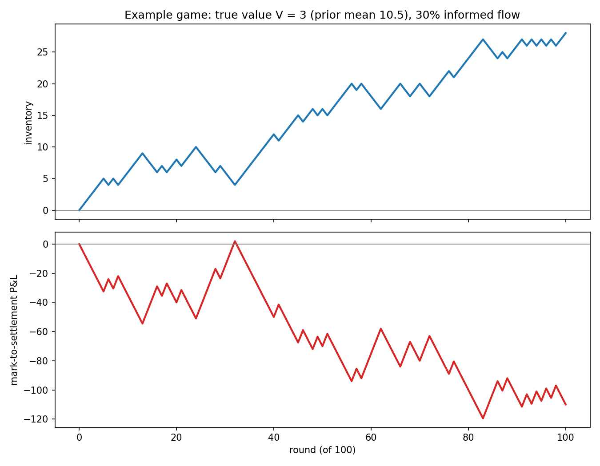
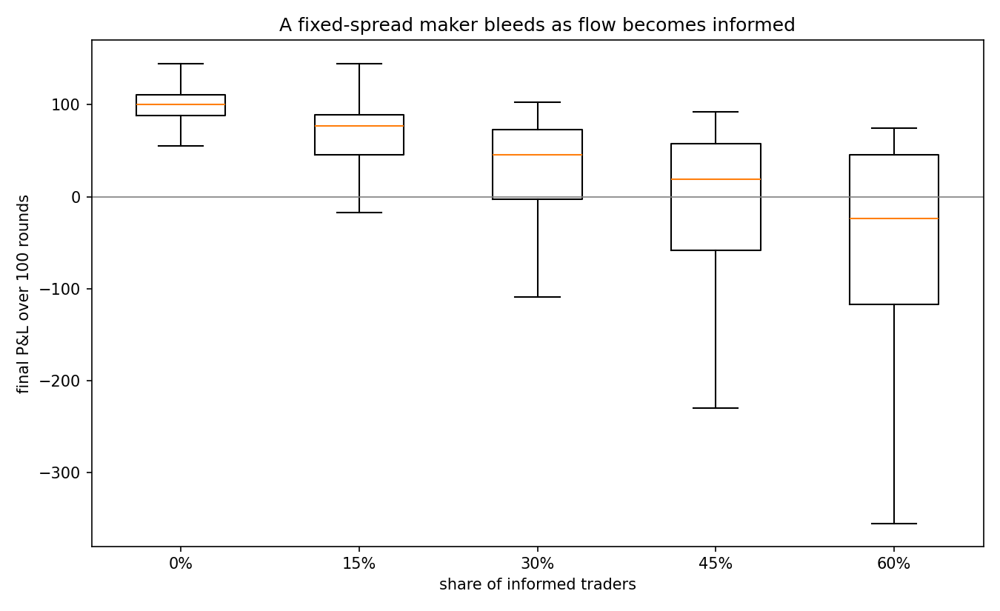

### Day 4: Strategies that fight back

Two upgrades over the naive maker, tested head-to-head on identical
market conditions (1,500 games per point):

- **Inventory-aware**: skews quotes against its position. Controls risk,
  learns nothing.
- **Bayesian**: maintains a posterior over V and updates it on every
  buy, sell, and pass (noise traders never pass, so a pass is pure
  signal that V lies between the quotes). Quotes centre on the
  posterior mean.

Mean P&L as informed flow rises from 0% to 60%:

| Informed share | Naive | Inventory-aware | Bayesian |
|---:|---:|---:|---:|
| 0% | 98.0 | 98.4 | 98.6 |
| 30% | 27.3 | 60.2 | 68.2 |
| 60% | **-46.2** | 41.0 | **48.4** |

The naive maker's losses were never about bad luck -- they were the
cost of not listening. The Bayesian maker extracts the information
content of the same flow that was bleeding the naive one, and stays
profitable even when a majority of traders are informed.

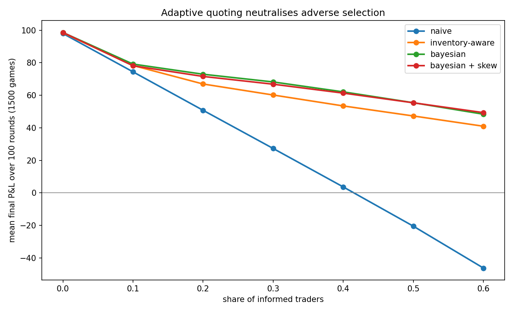
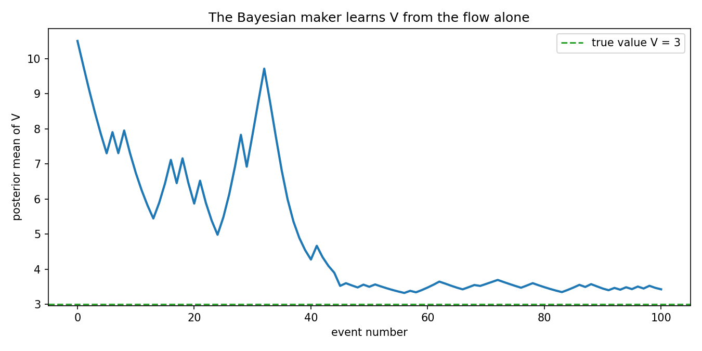

## Play it yourself

You can play as the market maker against the same flow, with the naive
bot scored on the identical trader sequence:

    python scripts/play_market_game.py
    python scripts/play_market_game.py --rounds 40 --informed 0.5

Watch for one-sided streaks (move your quotes toward the side being
hit) and passes (you are straddling V -- sit and collect).

## Section 2 -- A reinforcement-learning market maker

Can a model-free agent, seeing only a coarse summary of the order flow,
rediscover the quoting strategy that the Bayesian maker derives from
exact inference? The game becomes a POMDP: the hidden value V never
appears in the observation, so the agent must infer it from the flow.

**Environment** (src/rl_env.py, Gymnasium API). Observation: four
discretised features -- flow imbalance (buys minus sells), quote-centre
offset from the prior, inventory, and a coarse game clock. Action:
move the quote centre by one of {-1.0, -0.5, 0, +0.5, +1.0} at a fixed
+-1.0 spread. Reward: the per-fill mispricing (ask - V on a sale,
V - bid on a purchase), which telescopes exactly to the settled P&L --
a property pinned by a unit test. V is used to compute the reward
during training but is never observable to the agent.

**Agent** (src/qlearning.py). Tabular Q-learning (Watkins, 1989) over
7 x 7 x 5 x 3 states x 5 actions, epsilon-greedy exploration decaying
1.0 -> 0.05, gamma = 1 (episodic, monetary reward). Evaluation is
firewalled from training: greedy policy, held-out seed blocks, and
best-checkpoint selection with final reporting on a third, disjoint
seed block.

**Training results** (30% informed flow). A first run with constant
alpha = 0.1 oscillated between ~48 and ~18 and happened to end on a
dip (final-episode snapshot: 20.7) -- the motivation for checkpoint
selection. With alpha = 0.05 and best-checkpoint selection, the agent
scores **49.2 over 1,000 fresh held-out games**, against a naive /
hold-still benchmark of ~29 and a Bayesian-maker ceiling of ~68: the
agent recovers roughly half of the gap between never adapting and
exact inference, from four coarse features and no model of the game.
State-space coverage is 29% of bins -- most extreme-feature
combinations are simply unreachable in 100-round games.

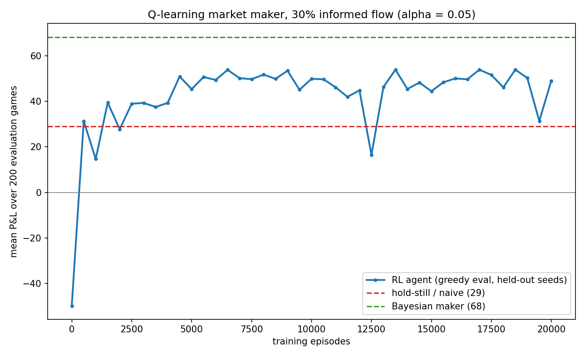

**Tournament entry** (src/rl_maker.py). The frozen Q-table is wrapped
as a MarketMaker and entered in the Day 4 tournament. Note the agent
was trained only at 30% informed flow, so the sweep tests it
out-of-distribution at the extremes:

| Informed share | Naive | Inventory-aware | Bayesian | RL (tabular Q) |
|---:|---:|---:|---:|---:|
| 0% | 98.0 | 98.4 | 98.6 | 97.9 |
| 30% | 27.3 | 60.2 | 68.2 | 50.7 |
| 60% | -46.2 | 41.0 | 48.4 | 15.3 |

The agent beats the naive maker at every informed share -- and stays
profitable at 60% informed, where naive loses heavily -- but does not
overtake the hand-designed inventory-aware heuristic. At this scale of
state space and training, a good inductive bias is hard to out-learn:
a limitation stated plainly, and the motivation for the DQN stretch
goal.

**Policy inspection** (scripts/inspect_policy.py). Cracking open the
Q-table produced three findings. First, a design discovery: because
the maker fills every trade, flow imbalance and inventory are
deterministically linked (inventory = -imbalance) -- the observation
has three effective degrees of freedom, not four, which explains the
29% state coverage. Second, Q-values are dominated by state value;
in many core cells the best action's margin over the runner-up is
within estimation noise, so the policy maps mask indifferent cells
rather than paint argmax-over-noise. Third, the decisive cells show
the agent rediscovered flow-following -- move quotes toward the side
being hit -- with a +0.33 directional correlation against the
Bayesian maker's empirical behaviour, plus a learned reversion floor:
it quotes back up into heavy sell flow once the centre falls below
where V can plausibly be, having inferred the support of the value
distribution from experience.

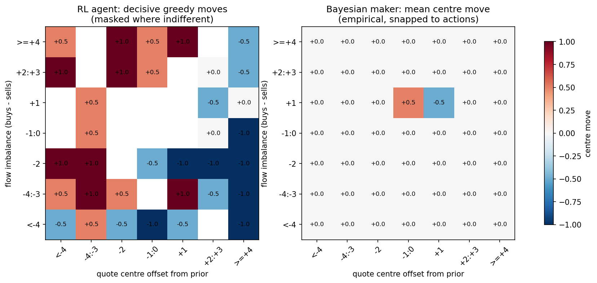

**Ablation: reward density** (scripts/ablate_reward_density.py). The
dense per-fill reward and a sparse settlement-only reward have an
IDENTICAL total per episode -- the only difference is when the agent
receives it. Dense reaches its plateau (~54) within ~2,000 episodes;
sparse eventually reaches a comparable level (~43) but only after a
catastrophic early dip to -230 and roughly 4x the episodes to
stabilise. Same objective, same algorithm -- the gap is entirely the
cost of credit assignment across 100 undifferentiated steps.

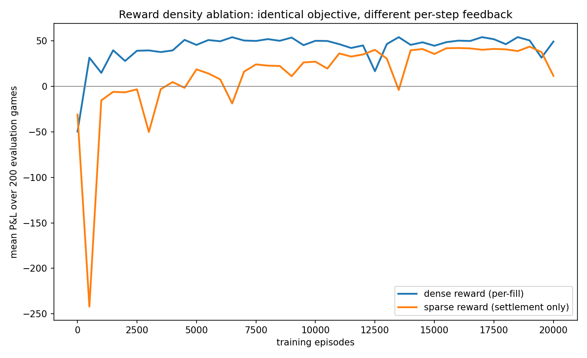

Remaining: removing the redundant imbalance feature, which the
degeneracy finding predicts should now cost nothing.

## Usage

Install dependencies and run the experiments:

    pip install -r requirements.txt
    python scripts/run_bankroll_sim.py       # Day 1: fraction comparison
    python scripts/run_estimation_study.py   # Day 2: estimated-edge studies
    python scripts/run_market_game.py        # Day 3: adverse selection
    python scripts/run_tournament.py         # Day 4 + RL: strategy tournament
    python scripts/train_rl_maker.py         # Section 2: train the RL maker

Run the test suite:

    python -m pytest

## Roadmap

- [x] Core Kelly criterion + expected log-growth
- [x] Vectorised bankroll path simulation with absorbing ruin
- [x] Fraction comparison study (fixed / half / full / double Kelly)
- [x] Kelly under parameter uncertainty (noisy and biased edge estimates)
- [x] Fractional Kelly as a robustness result
- [x] Market-making game engine with informed and noise flow
- [x] Adverse selection study for a fixed-spread maker
- [x] Inventory-aware and Bayesian market-making strategies
- [x] Strategy tournament: P&L vs informed share by strategy
- [x] Human-playable CLI mode
- [x] Gymnasium-style environment with discretised POMDP observations
- [x] Tabular Q-learning agent with seed-separated evaluation
- [x] Trained agent entered in the strategy tournament
- [x] Policy inspection and heatmaps
- [ ] Ablations: sparse reward, feature removal
- [ ] DQN via stable-baselines3 (stretch)
- [ ] Simultaneous correlated bets (portfolio Kelly)

## References

- Kelly, J. L. (1956). *A New Interpretation of Information Rate.*
- Thorp, E. O. (2006). *The Kelly Criterion in Blackjack, Sports Betting, and
  the Stock Market.*
- MacLean, Thorp & Ziemba (2011). *The Kelly Capital Growth Investment
  Criterion.*
- Glosten, L. & Milgrom, P. (1985). *Bid, Ask and Transaction Prices in a
  Specialist Market with Heterogeneously Informed Traders.*
- Watkins, C. (1989). *Learning from Delayed Rewards.*
- Sutton, R. & Barto, A. (2018). *Reinforcement Learning: An
  Introduction* (2nd ed.), chapters 3 and 6.
